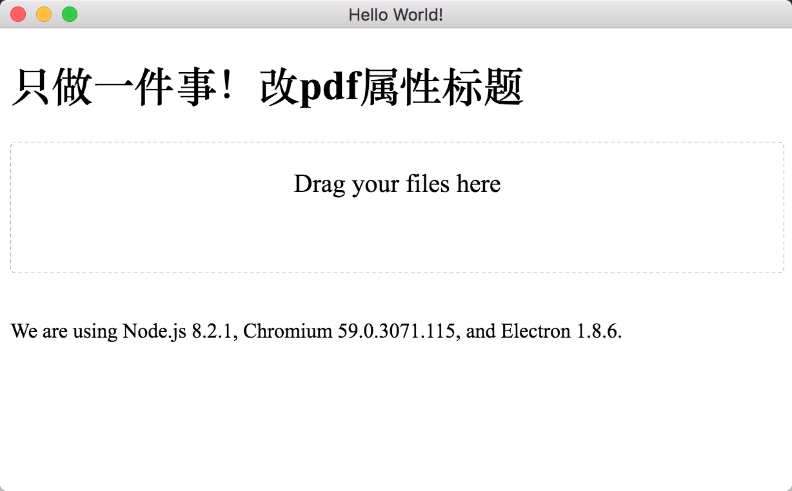

# pdf-exif-extract

A electron demo application just modify pdf title in metainfo. It wrap with [exiftool](https://sno.phy.queensu.ca/~phil/exiftool/#links)



## To Use

To clone and run this repository you'll need [Git](https://git-scm.com) and [Node.js](https://nodejs.org/en/download/) (which comes with [npm](http://npmjs.com)) installed on your computer. From your command line:

```bash
# Clone this repository
git clone https://github.com/oryx2/pdf-exif-extract.git
# Go into the repository
cd pdf-exif-extract
# Install dependencies
npm install
# Run the app
yarn start
```


## Build

```bash
# mac
yarn dist --mac
# win
yarn dist --win --x64
# linux
yarn dist --linux --x64
```
## License

[CC0 1.0 (Public Domain)](LICENSE.md)
